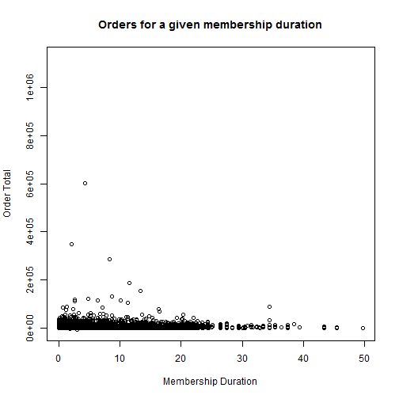

PDA Explorer Pitch
========================================================
author: Jonathan Hill
date: Sun May 24 19:24:41 2015

End to End Solution
========================================================

PDA Explorer makes data accessible by:

- Merging tables from three Aptify services
- Performing data manipulations for ploting
- Providing easy options for the end user to decide what they'd like to see
- Updating quickly in real time

Data
========================================================


```r
dat <- read.csv("dat.csv")
variables <- names(dat)
```
### Options List:
X, Committee.Type, Company, Title, Primary.Function, Member.Type, Is.Member, Preferred.Country, Email, Join.Date, Assigned.Chapter, Membership.Duration, Order.Total, Total.Orders, Booth, Chapter_Meeting, Conferences, Educational_Seminars, Exhibit_Registration, Memberships, Networking_Events, PDA_Journal_Articles_Electronic, PDADHI_Co.published_Books, Technical_Reports_Electronic, Technical_Reports_Print, Workshop, EU, Greater2011.

Better than a static base plot
========================================================

 

The App
========================================================
PDA Explorer puts the power of statistical programming in the hands of any staff member and allows them to explore the data with drop down menus and checkboxes.

[Start Using PDA Explorer](https://dripdrop12.shinyapps.io/PDA_Explorer/)
